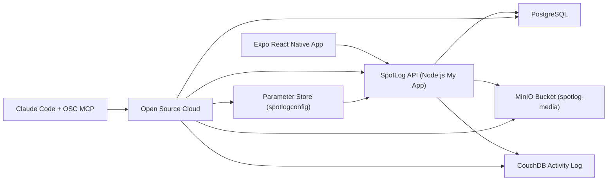

# SpotLog Architecture

## Notes

- The mobile app talks only to the SpotLog API.
- The API owns authentication, Postgres CRUD, image upload, and CouchDB activity mirroring.
- OSC MCP is the management layer for app restart, diagnostics, service provisioning, config changes, and domain management.
- Local testing uses the same API code path with OSC-backed service credentials injected as environment variables.
