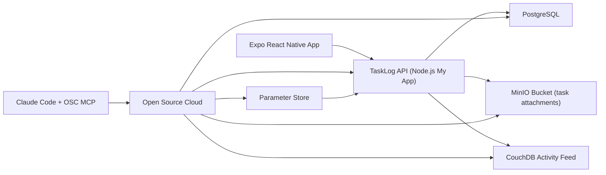

# TaskLog Architecture

## Notes

- The mobile app talks only to the TaskLog API.
- The API owns authentication, task/list CRUD, attachment upload, and activity mirroring.
- OSC MCP is the management layer for service provisioning, parameter-store changes, app restart, diagnostics, domain management, and service discovery.
- TaskLog exercises the same OSC capabilities required by the assignment: mobile client, managed API, database, storage, config, and catalog-service integration.
